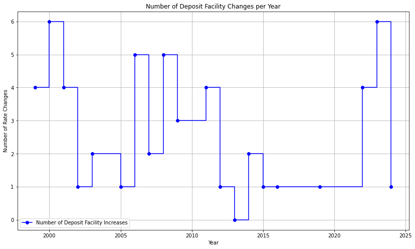
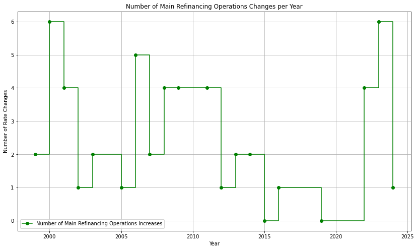
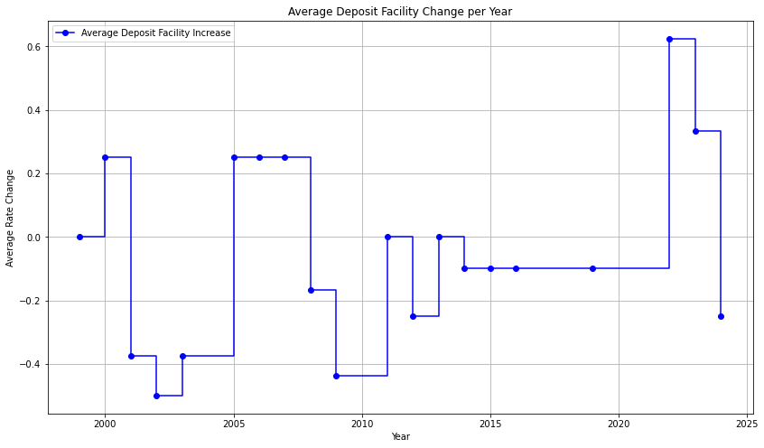
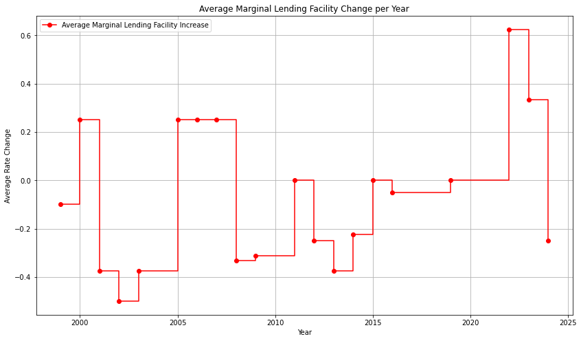

# Central Banks Interest Rates

## [ECB Interest Rates](https://www.ecb.europa.eu/stats/policy_and_exchange_rates/key_ecb_interest_rates/html/index.en.html)

| Date       | Deposit Facility | MRO: Fixed Rate | MRO: Variable Rate | Marginal Lending Facility |
|------------|------------------|-----------------|--------------------|---------------------------|
| 01/01/1999 |       2.00       |       3.00      |          -         |            4.50           |
| 04/01/1999 |       2.75       |       3.00      |          -         |            3.25           |
| 22/01/1999 |       2.00       |       3.00      |          -         |            4.50           |
| 09/04/1999 |       1.50       |       2.50      |          -         |            3.50           |
| 05/11/1999 |       2.00       |       3.00      |          -         |            4.00           |
| 04/02/2000 |       2.25       |       3.25      |          -         |            4.25           |
| 17/03/2000 |       2.50       |       3.50      |          -         |            4.50           |
| 28/04/2000 |       2.75       |       3.75      |          -         |            4.75           |
| 09/06/2000 |       3.25       |       4.25      |          -         |            5.25           |
| 28/06/2000 |       3.25       |        -        |         4.25       |            5.25           |
| 01/09/2000 |       3.50       |        -        |         4.50       |            5.50           |
| 06/10/2000 |       3.75       |        -        |         4.75       |            5.75           |
| 11/05/2001 |       3.50       |        -        |         4.50       |            5.50           |
| 31/08/2001 |       3.25       |        -        |         4.25       |            5.25           |
| 18/09/2001 |       2.75       |        -        |         3.75       |            4.75           |
| 09/11/2001 |       2.25       |        -        |         3.25       |            4.25           |
| 06/12/2002 |       1.75       |        -        |         2.75       |            3.75           |
| 07/03/2003 |       1.50       |        -        |         2.50       |            3.50           |
| 06/06/2003 |       1.00       |        -        |         2.00       |            3.00           |
| 06/12/2005 |       1.25       |        -        |         2.25       |            3.25           |
| 08/03/2006 |       1.50       |        -        |         2.50       |            3.50           |
| 15/06/2006 |       1.75       |        -        |         2.75       |            3.75           |
| 09/08/2006 |       2.00       |        -        |         3.00       |            4.00           |
| 11/10/2006 |       2.25       |        -        |         3.25       |            4.25           |
| 13/12/2006 |       2.50       |        -        |         3.50       |            4.50           |
| 14/03/2007 |       2.75       |        -        |         3.75       |            4.75           |
| 13/06/2007 |       3.00       |        -        |         4.00       |            5.00           |
| 09/07/2008 |       3.25       |        -        |         4.25       |            5.25           |
| 08/10/2008 |       2.75       |        -        |          -         |            4.75           |
| 09/10/2008 |       3.25       |        -        |          -         |            4.25           |
| 15/10/2008 |       3.25       |       3.75      |          -         |            4.25           |
| 12/11/2008 |       2.75       |       3.25      |          -         |            3.75           |
| 10/12/2008 |       2.00       |       2.50      |          -         |            3.00           |
| 21/01/2009 |       1.00       |       2.00      |          -         |            3.00           |
| 11/03/2009 |       0.50       |       1.50      |          -         |            2.50           |
| 08/04/2009 |       0.25       |       1.25      |          -         |            2.25           |
| 13/05/2009 |       0.25       |       1.00      |          -         |            1.75           |
| 13/04/2011 |       0.50       |       1.25      |          -         |            2.00           |
| 13/07/2011 |       0.75       |       1.50      |          -         |            2.25           |
| 09/11/2011 |       0.50       |       1.25      |          -         |            2.00           |
| 14/12/2011 |       0.25       |       1.00      |          -         |            1.75           |
| 11/07/2012 |       0.00       |       0.75      |          -         |            1.50           |
| 08/05/2013 |       0.00       |       0.50      |          -         |            1.00           |
| 13/11/2013 |       0.00       |       0.25      |          -         |            0.75           |
| 11/06/2014 |      −0.10       |       0.15      |          -         |            0.40           |
| 10/09/2014 |      −0.20       |       0.05      |          -         |            0.30           |
| 09/12/2015 |      −0.30       |       0.05      |          -         |            0.30           |
| 16/03/2016 |      −0.40       |       0.00      |          -         |            0.25           |
| 18/09/2019 |      −0.50       |       0.00      |          -         |            0.25           |
| 27/07/2022 |       0.00       |       0.50      |          -         |            0.75           |
| 14/09/2022 |       0.75       |       1.25      |          -         |            1.50           |
| 02/11/2022 |       1.50       |       2.00      |          -         |            2.25           |
| 21/12/2022 |       2.00       |       2.50      |          -         |            2.75           |
| 08/02/2023 |       2.50       |       3.00      |          -         |            3.25           |
| 22/03/2023 |       3.00       |       3.50      |          -         |            3.75           |
| 10/05/2023 |       3.25       |       3.75      |          -         |            4.00           |
| 21/06/2023 |       3.50       |       4.00      |          -         |            4.25           |
| 02/08/2023 |       3.75       |       4.25      |          -         |            4.50           |
| 20/09/2023 |       4.00       |       4.50      |          -         |            4.75           |
| 12/06/2024 |       3.75       |       4.25      |          -         |            4.50           |

- Before 10 March 2004 changes to the interest rate on the main refinancing operations were, as a rule, effective as of the first operation following the date indicated, unless stated otherwise. The change on 18 September 2001 was effective on that same day. From 10 March 2004 onwards, the date refers both to the deposit and marginal lending facilities and to the main refinancing operations (with changes effective from the first main refinancing operation following the Governing Council decision), unless otherwise indicated.

- On 22 December 1998 the ECB announced that, as an exceptional measure between 4 and 21 January 1999, a narrow corridor of 50 basis points would be applied between the interest rates for the marginal lending facility and the deposit facility, aimed at facilitating the transition to the new regime by market participants.

- On 8 June 2000 the ECB announced that, starting from the operation to be settled on 28 June 2000, the main refinancing operations of the Eurosystem would be conducted as variable rate tenders. The minimum bid rate refers to the minimum interest rate at which counterparties may place their bids.
- As of 9 October 2008 the ECB reduced the standing facilities corridor from 200 basis points to 100 basis points around the interest rate on the main refinancing operations.

- On 8 October 2008 the ECB announced that, starting from the operation to be settled on 15 October 2008, the weekly main refinancing operations would be carried out through a fixed-rate tender procedure with full allotment at the interest rate on the main refinancing operations. This change overrode the previous decision (made on the same day) to cut by 50 basis points the minimum bid rate on the main refinancing operations conducted as variable rate tenders.

- On 13 March 2024 the ECB announced changes to its operational framework for implementing monetary policy. The spread between the rate on the main refinancing operations and the deposit facility rate will be reduced to 15 basis points. The rate on the marginal lending facility will also be adjusted such that the spread between the rate on the marginal lending facility and the rate on the main refinancing operations will remain unchanged at 25 basis points. These changes will come into effect on 18 September 2024. The main refinancing operations will continue to be conducted through fixed-rate tenders with full allotment against broad collateral.